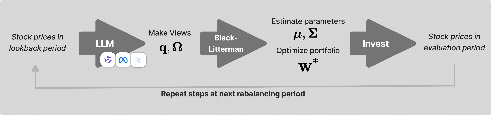
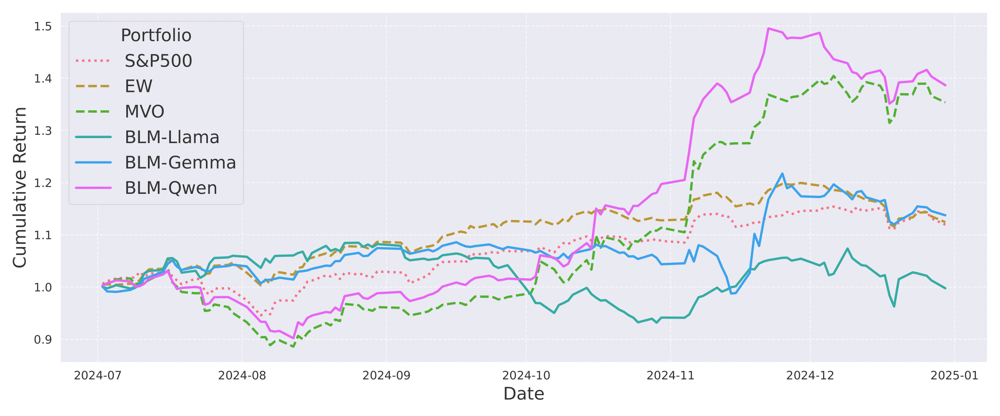
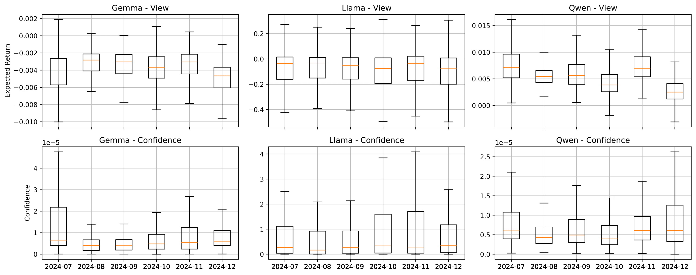

# Integrating LLM-Generated Views into the Black-Litterman Model 

 > This is an official implementation of the paper `Integrating LLM-Generated Views into the Black-Litterman Model`, submitted to `ICLR 2025 Workshop on Advances in Financial AI: Opportunities, Innovations, and Responsible AI`.




## Project Structure

```
.
├── run.py                  # Main file to run LLMs and collect their views
├── baselines.py           # Implementation of baseline portfolio strategies
├── calculate_llm_returns.py # Calculates returns for LLM-based portfolios
├── evaluate_multiple.py    # Evaluates multiple portfolio strategies
├── responses/             # Stores LLM predictions and views
├── responses_portfolios/  # Contains baseline portfolio weights and returns
├── results/              # Final evaluation results
└── yfinance/             # Downloaded stock price data
```

## Workflow Description

### 1. Data Collection and LLM Views (`run.py`)
- Downloads S&P 500 stock price data using yfinance API
- Data is stored in the `yfinance/` directory
- Queries different LLM models (GPT, LLaMA, Gemma) for stock return predictions
- LLM responses are stored in `responses/` directory as JSON files

### 2. Baseline Portfolio Construction (`baselines.py`)
- Implements two baseline portfolio strategies:
  1. Equal-weighted portfolio
  2. Mean-variance optimized portfolio
- Processes data monthly from June 2024 to December 2024
- Portfolio weights and returns are stored in `responses_portfolios/`

### 3. Portfolio Evaluation
The evaluation process is split into two main components:

#### a. LLM Returns Calculation (`calculate_llm_returns.py`)
- Processes the LLM-based portfolio weights
- Calculates portfolio returns for each LLM strategy
- Results are stored in `results/` directory

#### b. Multiple Strategy Evaluation (`evaluate_multiple.py`)
- Implements Black-Litterman portfolio optimization using LLM views
- Processes multiple time periods
- Generates final performance metrics and comparisons
- Stores final evaluation results in `results/` directory





## File Descriptions

### Main Files
- `run.py`: Main entry point for collecting LLM views on stock returns
- `baselines.py`: Implements baseline portfolio construction strategies
- `calculate_llm_returns.py`: Calculates returns for LLM-based portfolios
- `evaluate_multiple.py`: Evaluates and compares different portfolio strategies

### Directories
- `responses/`: Contains JSON files with LLM predictions for each stock
- `responses_portfolios/`: Stores baseline portfolio weights and returns
- `results/`: Contains final evaluation results and performance metrics
- `yfinance/`: Stores downloaded stock price data and returns

## Usage

1. Run LLM predictions:
```bash
python run.py --model_name [gpt|llama|gemma]
```

2. Generate baseline portfolios:
```bash
python baselines.py
```

3. Calculate returns and evaluate strategies:
```bash
python calculate_llm_returns.py
python evaluate_multiple.py
``` 
